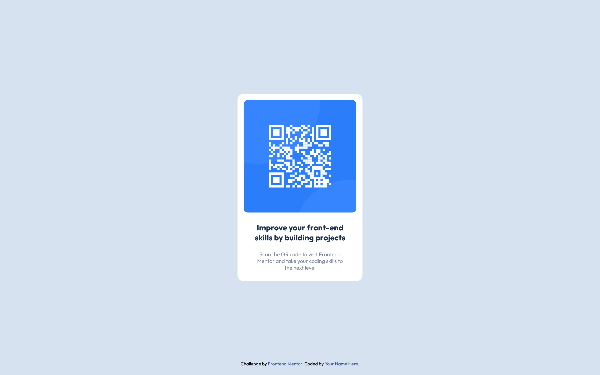

# Frontend Mentor - QR code component solution

This is a solution to the [QR code component challenge on Frontend Mentor](https://www.frontendmentor.io/challenges/qr-code-component-iux_sIO_H).

## Table of contents

- [Overview](#overview)
  - [Screenshot](#screenshot)
  - [Links](#links)
- [My process](#my-process)
  - [Built with](#built-with)
  - [Continued development](#continued-development)
  - [Useful resources](#useful-resources)
- [Author](#author)

## Overview

### Screenshot

### Links

- Solution URL: [Solution for Front-end Mentor - QR Code Component Challenge](https://github.com/thaisribeirotr/project-QRcodeComponent-frontendmentor)
- Live Site URL: [QR Code Component](https://thaisribeirotr.github.io/project-QRcodeComponent-frontendmentor)

## My process

### Built with

- HTML5
- CSS
  - Display: Flexbox

### Continued development

I still see some issue with the code from "Front-End Mentor" where we give it attribution for the challenge. It is overlapping the QR Code Component when in smaller sizes. I will come back latter to try an figure out how to solve it with flex-box.

### Useful resources

- [Flexbox Froggy] (https://flexboxfroggy.com/) - This helped me in understanding a bit better about flexbox and how it works.

## Author

- Website - [Thais Ribeiro](https://github.com/thaisribeirotr)
- Frontend Mentor - [@yourusername](https://www.frontendmentor.io/profile/thaisribeirotr)
- Twitter - [@thaisribeiro](https://www.twitter.com/thaisribeiro)
- Instagram - [@thaisribeirotr](https://www.instagram.com/thaisribeirotr)
